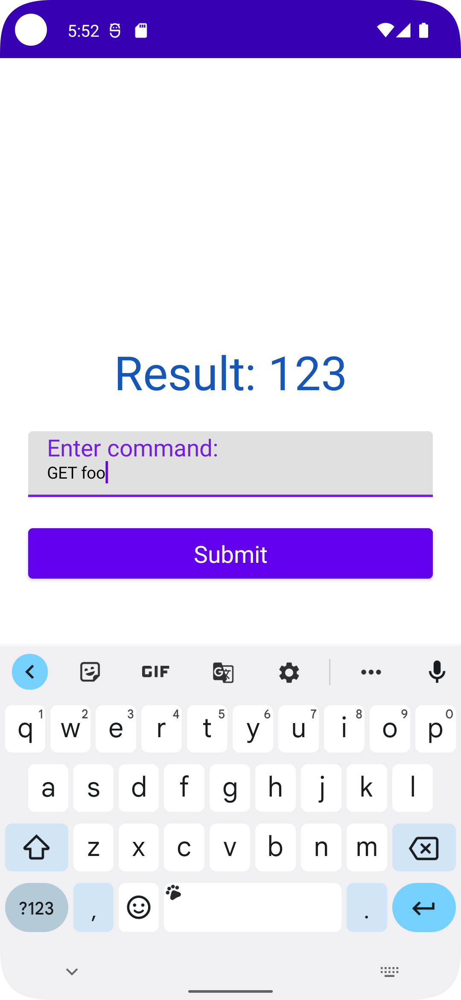
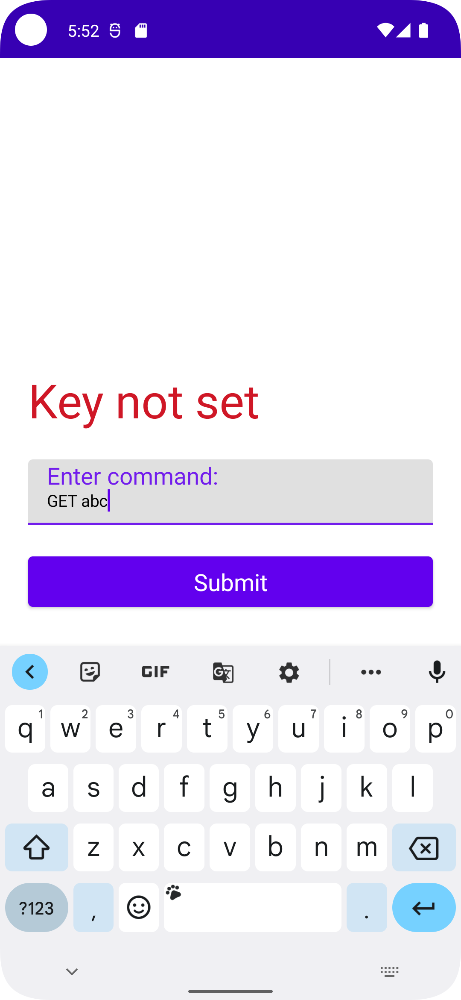

# TransactionStore

## Project Notes

The following features and techniques have been implemented/used:
* MVI architecture is used for presentation/view layer, utilising [Blockchain.com MVI](https://github.com/blockchain/My-Wallet-V3-Android/blob/master/commonarch/src/main/java/com/blockchain/commonarch/presentation/mvi_v2/MVI.kt)
* Unit-tests with `JUnit4` for `TransactionStoreService`
* Compose for UI
* `Koin` for dependency injection
* `Either` from `Arrow Core` to handle exceptions

# Example Screens

|Success|Error|
| -- | -- |
|  |  |
